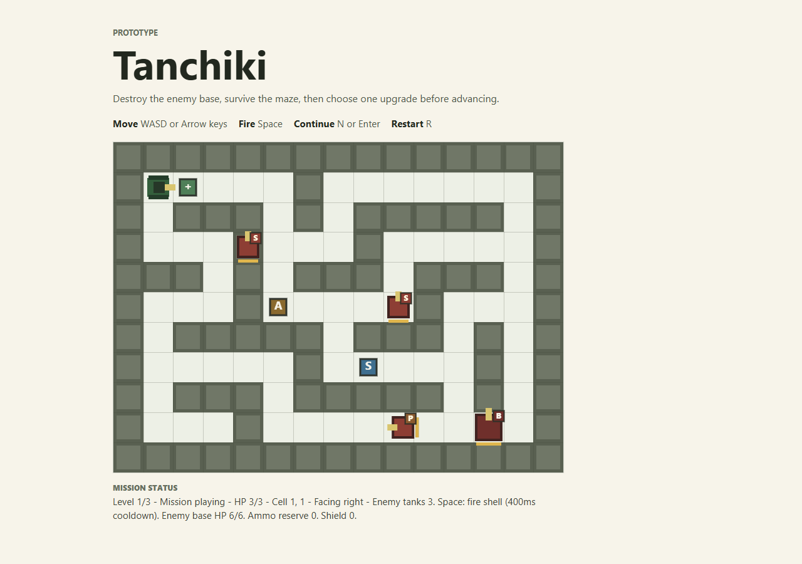
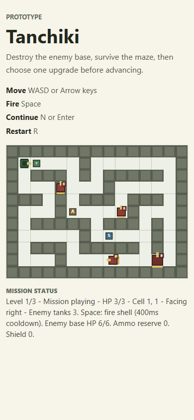

# Public Demo Notes

These notes support the first public Tanchiki demo release.

## Demo Target

Public URL:

```text
https://urkrass.github.io/Tanchiki/
```

GitHub Pages deployment is configured, but the repository Pages setting must allow GitHub Actions deployment before the public URL is live.

Until that setting is enabled, use the local fallback below as the expected demo verification path.

Local fallback:

```powershell
npm run dev
```

Open `http://localhost:5173`.

## Screenshots

Desktop:



Narrow viewport:



## First Demo Loop

The current demo starts directly in Level 1 with the objective and controls visible above the canvas. The expected first-run loop is:

1. Read the objective and controls.
2. Move with WASD or Arrow keys.
3. Fire with Space.
4. Destroy the enemy base while surviving enemy fire.
5. Choose one upgrade after victory.
6. Continue to the next level with `N` or Enter.

The campaign includes three levels, sentries, patrol enemies, pursuit enemies, pickups, mission summaries, XP rewards, and an in-memory upgrade flow.

## Release Operator Checks

Before sharing the demo, run:

```powershell
npm test
npm run build
npm run lint
```

Then open the local or public demo and confirm:

- objective and controls are visible before play
- the canvas renders the current level
- mission status updates while playing
- Level 1 can be played without needing hidden instructions
- victory shows the upgrade flow
- the next-level action is visible after choosing an upgrade
- the narrow viewport keeps the objective, controls, status, and canvas readable

## Known Limitations

- Progress is in-memory only; there is no save or persistence.
- The included sprite sheet is still reference art, not a final production atlas.
- There is no audio, pause menu, settings menu, or mobile touch control layer.
- The public URL may remain unavailable until GitHub Pages is enabled for GitHub Actions in repository settings.
- This release does not include movement, collision, AI, progression, or level-retuning rewrites.
